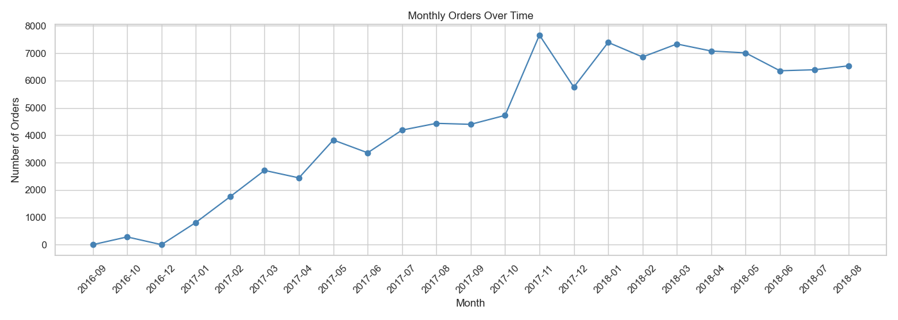
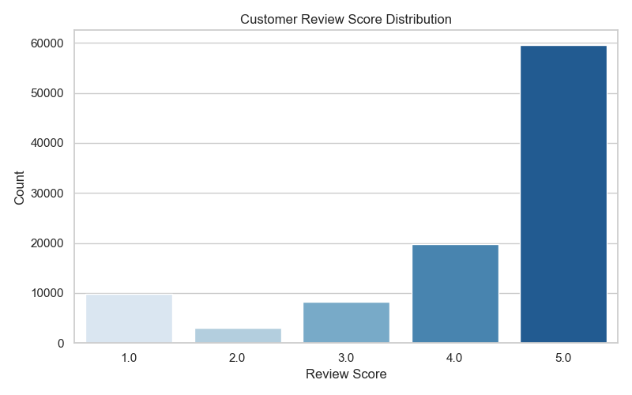
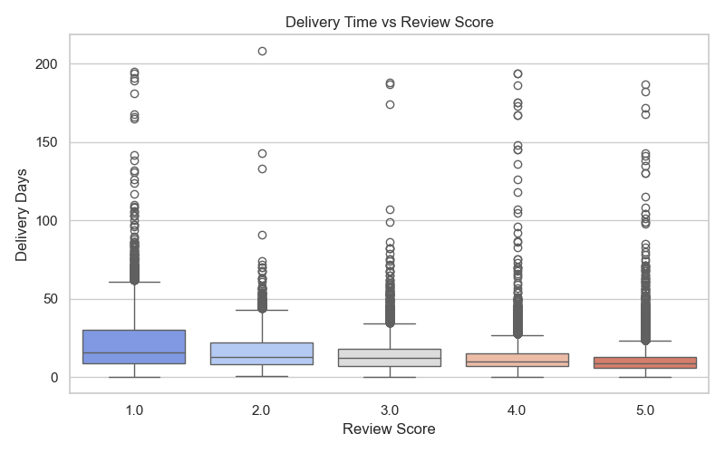

# ecommerce-analysis
Analysis of 100k+ orders from Olist Brazilian E-Commerce platform
# 🛒 E-Commerce Customer Behavior Analysis

## 📌 Project Overview
Analysis of 100k+ orders from Olist, a Brazilian e-commerce platform.
Explored sales trends, delivery performance, and customer satisfaction.

## 🔧 Tools Used
- Python (Pandas, Matplotlib, Seaborn)
- Jupyter Notebook

## 📊 Key Findings
- Orders peaked in **November 2017** (Black Friday effect)
- Longer delivery times directly correlate with **lower review scores**
- **Credit card** is the dominant payment method (~74% of orders)

## 📈 Visualizations

## 📁 Project Files
| File | Description |
|---|---|
| `analysis.ipynb` | Full analysis notebook |
| `monthly_orders.png` | Orders over time chart |
| `review_scores.png` | Review distribution chart |
| `delivery_vs_review.png` | Delivery time vs satisfaction |

## 🚀 How to Run
1. Clone this repo
2. Install requirements: `pip install pandas matplotlib seaborn`
3. Open `analysis.ipynb` in Jupyter Notebook
